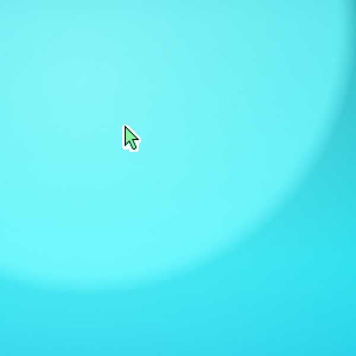
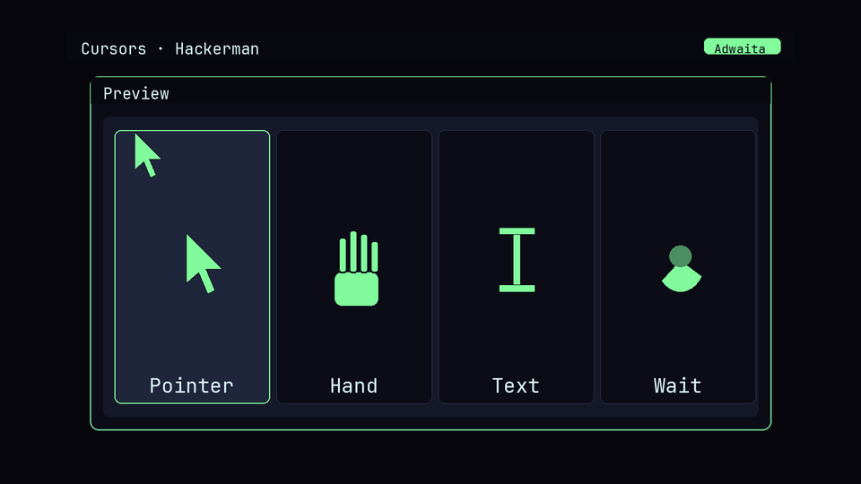

# OmaCursor

**Omarchy themes your desktop. OmaCursor carries the same palette into the
pointer — mockup previews in the Style menu, then a real Adwaita recolor Hyprland
and GTK can load.**



Stock Omarchy paints Hyprland, the terminal, and (with Chroma) your GTK apps.
The mouse cursor stays default Adwaita black/white in every theme. Your desktop
wears Hackerman neon; the pointer still looks like a stock GNOME install.

OmaCursor closes that gap the same way Style → OBS Themes works: a labelled
image picker, one mockup per installed theme, and an apply step that writes
what the compositor understands. Pick once, or let `omarchy theme set` keep
cursors in lockstep forever after.



## Goals (and honest limits)

These Style plugins extend Omarchy’s theme system **without requiring theme
authors — or you — to ship anything extra**. Official themes, your forks, and
third-party installs all work as long as they have a `colors.toml`. That
“every theme” contract is intentional: once the desktop can follow farther,
making *another* theme is more worth it. Longer origin / stop-line:
[Chroma](https://github.com/AlxWolfenstein97/chroma).

| Goal | What that means here |
|------|----------------------|
| Zero extra assets | No per-theme cursor packs. Colours come from `colors.toml` alone. |
| Extreme compatibility | Stock + user + foreign themes all appear in the picker automatically. |
| Illustrative mockups | Dense Catppuccin-style grid of every unique Adwaita state, recolored with the same map as apply. **Not** live captures. |
| Carousel-safe | Mockups are 1536×864 with ~8% side inset so the Style tile crop does not shave the subject. |
| Snappy pickers | Mockups warm in parallel across CPU cores, **skip unchanged** `colors.toml` tiles, and vectorize Adwaita remaps with NumPy. Often feels **faster** than Omarchy’s stock Theme / Unlock carousels despite generating tiles — we skip unchanged PNGs and never bake a full XCursor theme per tile. |

A full XCursor bake per theme just for the carousel would be wasted work. The
applied `Omarchy` cursor theme *is* that bake; picker art samples the same
shapes and palette without writing icon dirs.

## What you get

- **Style → Cursors** in the Omarchy menu — same carousel picker as Unlock /
  Theme / OBS / Boot.
- **Live theme discovery** — every Omarchy theme with a `colors.toml`.
- **Mockups** — all unique Adwaita states in a small-icon grid on themed
  chrome, coloured from that theme’s accent / foreground / backgrounds.
- **Real cursors** — stock Adwaita XCursor files remapped (fill → accent,
  outline → contrasting ink) into alternating
  `~/.local/share/icons/Omarchy-{a,b}/` slots (live reload without reboot).
- **Apply wiring** — `hyprctl setcursor` (bounce via Adwaita), `XCURSOR_THEME`
  via Hyprland env + `environment.d` + user systemd, and
  `org.gnome.desktop.interface cursor-theme`.
- **theme-set hook + service safety net** — `omarchy theme set …` keeps
  cursors in step; the shell service retries if a switch somehow skips the hook.
- **Optional SDDM** — `install.sh --with-sddm` mirrors into
  `/usr/share/icons/Omarchy` + `CursorTheme=Omarchy` so the greeter matches
  (handy next to themed Plymouth on unencrypted installs).
- **Default** tile — restores stock Adwaita.


## Marketplace consent (hooks & Style menu)

Installing the plugin only drops the code into your plugins folder. Writing a
**Style** menu row or a **theme-set** hook edits your Omarchy config, so that
stays **opt-in** (marketplace rule: no silent config overwrite).

Interactive `./install.sh` asks once (default Yes). Or run later:

```sh
# Style menu row (plugins that have a Style → … picker)
./tools/install-style-menu.sh

# Follow `omarchy theme set` automatically (Chroma / OmaCursor / OmaOBS / OmaHud)
./tools/install-theme-hook.sh
```

(style-menu + theme-hook)

Paths are under `~/.config/omarchy/plugins/io.github.alxwolfenstein97.omacursor/`.
Quiet shell restarts only restore what you already armed. `./uninstall.sh`
clears the arming flags too.

## Install

```sh
omarchy plugin add https://github.com/AlxWolfenstein97/omacursor.git --enable
```

That clones into `~/.config/omarchy/plugins/io.github.alxwolfenstein97.omacursor`.
Or from a checkout:

```sh
~/.config/omarchy/plugins/io.github.alxwolfenstein97.omacursor/install.sh
omarchy plugin enable io.github.alxwolfenstein97.omacursor
```

**Optional — SDDM login cursor** (greeter after you reach the login screen;
encrypted installs still use Plymouth for the LUKS passphrase — no mouse there):

```sh
~/.config/omarchy/plugins/io.github.alxwolfenstein97.omacursor/install.sh --with-sddm
```

Password once. This does **more** than drop `CursorTheme=` into sddm.conf —
Omarchy’s greeter is Wayland/Hyprland, and SDDM’s `CursorTheme` is ignored
there ([sddm#1996](https://github.com/sddm/sddm/issues/1996)). Hyprland also
falls back to `/usr/share/icons/default` (stock: Adwaita). OmaCursor therefore:

- publishes `/usr/share/icons/Omarchy`
- ships a **self-contained** `/usr/share/icons/default/cursors/` tree (does
  **not** touch stock Adwaita)
- installs `/etc/sddm/omacursor-hyprland.lua` with `hl.env` + `hyprctl setcursor`
- overrides `CompositorCommand=` to `/usr/local/lib/omacursor/sddm-compositor`
- sets passwordless `sudo -n /usr/local/lib/omacursor/sync-sddm` for later switches

Log out once after `--with-sddm`. Greeter cursor theming works with that path —
no Adwaita hijack required. Debug: `/var/log/omacursor-sddm.log`.

**Needs (installer pulls these if missing):**

| Package | Why |
|---------|-----|
| `python-pillow` | Draws the Style → Cursors mockup PNGs (Pillow). Without it the carousel is empty / broken on first open. |
| `python-numpy` | Vectorizes Adwaita fill→outline remaps for mockups and apply so cold warm / theme flips stay fast. Pure-Python fallback if somehow missing. |

**Already on Omarchy:** `adwaita-cursors` (stock pointer shapes). OmaCursor only
recolours those — the installer does **not** pull a duplicate cursor package.
NumPy is **not** an Omarchy dep either; we pull it ourselves so every install
gets the fast remap path (not only boxes that already have MangoHud / matplotlib).

Also uses Omarchy’s image picker (`omarchy-menu-images`). Order matters: Pillow
+ NumPy first, then background mockup warm — `install.sh` does that for you.

## How it works

1. `bin/omacursor-switcher` renders PNG mockups into
   `~/.cache/omarchy/omacursor/previews/`, then opens `omarchy-menu-images`
   with `--selected` pointing at the *current* PNG (so the carousel remembers).
2. On selection / `theme-set`, `omacursor-set` remaps Adwaita into the
   **inactive** slot (`Omarchy-a` ↔ `Omarchy-b`). Hyprland caches cursors by
   theme *name* — overwriting the same folder never reloads until reboot, which
   is why we flip the name and bounce via Adwaita.
3. Apply points Hyprland / GNOME / `environment.d` / the session env at the
   new slot. A stable `Omarchy` symlink always points at the active slot.
4. `~/.config/omarchy/hooks/theme-set.d/omacursor` runs `omacursor sync` after
   every desktop theme change; the shell service is a Chroma-style safety net.

CLI:

```sh
omacursor list
omacursor preview              # warm all mockups
omacursor switcher             # picker → prints slug
omacursor set tokyo-night      # generate + apply (live)
omacursor sync                 # apply current desktop theme
omacursor current
omacursor revert               # back to stock Adwaita
```

## Why live apply used to need a reboot

Hyprland (and libxcursor) key the in-memory cursor cache on the theme name.
v1.0 wrote into a single `Omarchy` directory and called `setcursor Omarchy`
again — the compositor kept serving the old pixels until a cold start. v1.1
alternates `Omarchy-a` / `Omarchy-b` so every apply is a *new* theme name.

## Fresh VM smoke test

```sh
omarchy plugin add https://github.com/AlxWolfenstein97/omacursor.git --enable
# Style → Cursors appears without a shell restart; carousel tiles warm (needs python-pillow)
# Pick a loud theme; confirm the surface updates (Hypr cursor; optional SDDM cursor — works if you log out through SDDM even on encrypted (Plymouth still owns LUKS))
# Skip install floater → logout/reboot → floater returns (shell restart does not re-nag)
# Parallel Style plugins share one Pillow floater; siblings only ask for their own missing pkgs
# ./uninstall.sh → reset floater (cursor theme restored / SDDM bits torn down) + optional itemized pkg drop (Pillow notes Required By)
# Skip remove floater + disable → reinstall → uninstall again → complete the floater
# With mangohud/goverlay kept, Pillow drop may fail — fine; clear/uninstall still work without Pillow
```

## Disable vs remove

| Action | What happens |
|--------|----------------|
| `omarchy plugin disable …` | Shell service stops. **Theme-set hook still runs** — cursors stay synced on every desktop theme flip. |
| `./uninstall.sh` then disable / remove | Menu, hook, Hypr/env wiring, `Omarchy-{a,b}` slots, state/cache gone; stock Adwaita restored. With `--with-sddm`, greeter wiring torn down too. Tombstone + disable **first** so Service quiet cannot resurrect the Style row. Optional floating terminal (y/N) for `pkg drop`. |
| `omarchy pkg drop python-pillow` | Optional. Itemized floater shows why + `pacman Required By`. Clear still works without Pillow. |
| `omarchy pkg drop python-numpy` | Optional. Only if nothing else needs NumPy. |

Quiet Service install: one-shot package prompt (shared Pillow flock across Style plugins), theme-set hook kept, menu written
only if `// omacursor:start` markers are missing; also scrubs orphan Style rows for
sibling plugins removed without `uninstall.sh`.

**Full wipe** — wiring + optional packages (skip a drop if something else needs
it):

```sh
~/.config/omarchy/plugins/io.github.alxwolfenstein97.omacursor/uninstall.sh
omarchy plugin remove io.github.alxwolfenstein97.omacursor
# pkg drop offered in a floating terminal; or drop pillow / numpy by hand
```

## Limits, honestly

- **Some apps keep the old pointer until you leave the window** — after a
  cursor or desktop theme switch, a few clients only pick up the new theme
  when the pointer enters another window (or the same window again). Nudge
  the mouse across a window edge; not an OmaCursor bug, just how those apps
  cache the shape.
- **Stuck on the pointer shape after a big kernel (or similar) update** —
  cursor still visible, but every hover stays the default arrow. Swap Style →
  Cursors (or the desktop theme) back and forth once or twice; it usually
  heals itself. Same class of compositor/cursor-cache weirdness as the
  window-edge nudge above.
- **Stuck on the busy/spinner cursor while nothing is loading** — seen after
  a stretch of shell reloads / plugin tinkering (AI work, install loops, lots
  of `omarchy restart shell`). Pointer sits on the progress/wait shape with no
  app actually busy. Same fix: swap Style → Cursors or the desktop theme a
  couple of times and it clears. More of a “reload the session too hard”
  quirk than a normal daily-driver one.
- **Steam** — locks the cursor theme it saw at launch. After a Style → Cursors
  (or desktop theme) switch, tray-quit Steam fully and reopen; otherwise you
  get a mix of old and new. Not much to fix on our side.
- **Root / elevated apps** — `sudo` / `pkexec` GUIs keep whatever cursor was
  current at boot (or when that process tree started). Session `hyprctl` /
  `gsettings` do not reach them. Same class of problem as Steam.
- **Plymouth / encrypted installs** — the LUKS passphrase screen has no mouse
  cursor. OmaCursor cannot theme that; use Style → Unlock / Plymouth for the
  chrome. SDDM greeter cursor still works on encrypted boxes if you log out and
  come back through SDDM (same `--with-sddm` path as unencrypted).
- **SDDM Wayland** — `[Theme] CursorTheme=` alone does nothing for Omarchy’s
  Hyprland greeter. `--with-sddm` overrides `CompositorCommand`, sets
  `hyprctl setcursor`, and ships self-contained default cursors. **Never
  hijacks Adwaita** — that was tried once, broke GTK/Qt with an inherit loop,
  and is gone.
- **First greeter start** — log out once after `--with-sddm`.

If you barely switch themes: pick something you like, reboot once, and stop
worrying about live reload edge cases.

## Why not pure Chroma-style background sync?

Chroma (GTK/Qt) only needs to rewrite a few CSS files — perfect for silent
sync. Cursors are one surface, not two toolkits: a Style picker lets you
*see* the recolor across every installed theme before living with it, faster
than flipping themes manually just to judge the pointer. Mockups warm across
CPU cores, skip unchanged `colors.toml` tiles, and vectorize remaps with NumPy
so reopen feels like Omarchy’s stock art pickers. The theme-set
hook still mirrors Chroma’s “set it and forget it” sync after you pick (or on
first install).

## Check

```sh
bash ~/.config/omarchy/plugins/io.github.alxwolfenstein97.omacursor/check.sh
```

## Credits

- Sibling Style plugins: [OmaOBS](https://github.com/AlxWolfenstein97/omaobs),
  [OmaBoot](https://github.com/AlxWolfenstein97/omaboot),
  [OmaVT](https://github.com/AlxWolfenstein97/omavt),
  [OmaTTY](https://github.com/AlxWolfenstein97/omatty),
  [OmaHud](https://github.com/AlxWolfenstein97/omahud),
  [Chroma](https://github.com/AlxWolfenstein97/chroma).
- [OMCP](https://github.com/btsouth/omarchy-omcp) — MCP desktop bridge (themes,
  workspaces, screenshots, …). Helped land the Hackerman preview shot here:
  `omarchy plugin add https://github.com/btsouth/omarchy-omcp --enable`
- [Omarchy](https://omarchy.org/) — theme pipeline, Style menu image picker, and
  `theme-set` hooks this plugin hooks into.
- Stock shapes from GNOME’s Adwaita cursors (`adwaita-cursors`).

## License

MIT — see [LICENSE](LICENSE).
